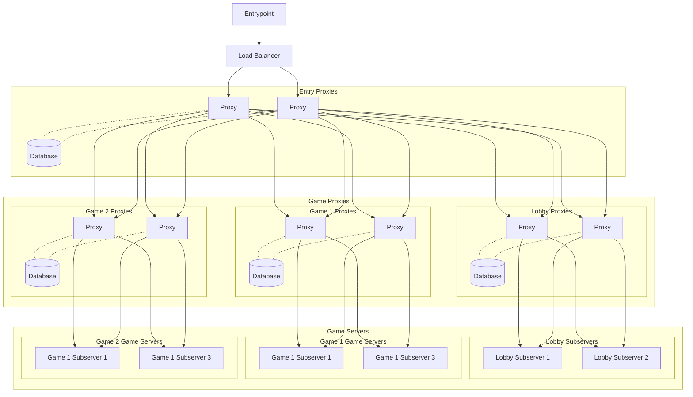

# Redstonecloud

This project is currently under development and far from finished. Using it is currently not possible, but you can investigate the source code and test it out if you know what you're doing.

## Goal
My goal is to build an ecosystem around Minecraft networks providing a web interface to set it up.
It can run on any current Windows or Linux installation but its target is something like Kubernetes
running a master pod for managing java installations, templates and persistent data storage
and many agents for all the workload. Using LoadBalancers for Proxies allows a giant number of players on the same network.

You can join [here](https://discord.gg/aZKuas4) to discuss this project or use the discussion tab.

## Concept

