# Redstonecloud

This project is currently under development and far from finished. Using it is currently not possible, but you can investigate the source code and test it out if you know what you're doing.

## Goal
The goal is to build an ecosystem around Minecraft networks providing a web interface (maybe).
It runs on Kubernetes to be highly capable and organized.
Using LoadBalancers for Proxies allows a giant number of players on the same network.
To horizontally scale the system, the plugin provides some metrics to Kubernetes.

You can join [here](https://discord.gg/aZKuas4) to discuss this project or use the discussion tab.

## Concept

```mermaid
flowchart TB
    entrypoint[Entrypoint] --> loadbalancer[Load Balancer]:::service --> proxy_1 & proxy_2 --> lobby_entrypoint & game_1_entrypoint & game_2_entrypoint
    subgraph proxies [Entry Proxies]
        proxy_1[Proxy]:::proxy
        proxy_2[Proxy]:::proxy
    end

    subgraph subproxies [Game Proxies]
        lobbyproxy_db_1[(Database)]:::db
        game_1_proxy_db_1[(Database)]:::db
        game_2_proxy_db_1[(Database)]:::db

        subgraph lobbyproxies [Lobby Proxies]
            lobby_entrypoint[Service]:::service --> lobby_proxy_1[Proxy] & lobby_proxy_2[Proxy]
        end
        subgraph game1proxies [Game 1 Proxies]
            game_1_entrypoint[Service]:::service --> game_1_proxy_1[Proxy] & game_1_proxy_2[Proxy]
        end
        subgraph game2proxies [Game 2 Proxies]
            game_2_entrypoint[Service]:::service --> game_2_proxy_1[Proxy] & game_2_proxy_2[Proxy]
        end
    end
    
    lobby_proxy_1 & lobby_proxy_2 -.- lobbyproxy_db_1 -.- lobby_sub_1 & lobby_sub_2
    game_1_proxy_1 & game_1_proxy_2 -.- game_1_proxy_db_1 -.- game_1_sub_1 & game_1_sub_2
    game_2_proxy_1 & game_2_proxy_2 -.- game_2_proxy_db_1 -.- game_2_sub_1 & game_2_sub_2
    
    subgraph gameservers [Game Servers]
        lobby_proxy_1 & lobby_proxy_2 ---> lobby_sub_1 & lobby_sub_2
        game_1_proxy_1 & game_1_proxy_2 ---> game_1_sub_1 & game_1_sub_2
        game_2_proxy_1 & game_2_proxy_2 ---> game_2_sub_1 & game_2_sub_2

        subgraph lobby_sub [Lobby Subservers]
            lobby_sub_1[Lobby Subserver 1]:::game
            lobby_sub_2[Lobby Subserver 2]:::game
        end
        subgraph game_1_sub [Game 1 Subservers]
            game_1_sub_1[Game 1 Subserver 1]:::game
            game_1_sub_2[Game 1 Subserver 2]:::game
        end
        subgraph game_2_sub [Game 2 Subservers]
            game_2_sub_1[Game 2 Subserver 1]:::game
            game_2_sub_2[Game 2 Subserver 2]:::game
        end
    end
    
    classDef default fill:#121213,color:white,stroke:white;
    classDef proxy fill:#0f0,color:black;
    classDef game fill:yellow,color:black;
    classDef db fill:grey;
    classDef service fill:#326ce5;
    classDef outer fill:#222;

    class subproxies,gameservers,proxies outer;

    class lobby_proxy_1,lobby_proxy_2,game_1_proxy_1,game_1_proxy_2,game_2_proxy_1,game_2_proxy_2 proxy;
```

