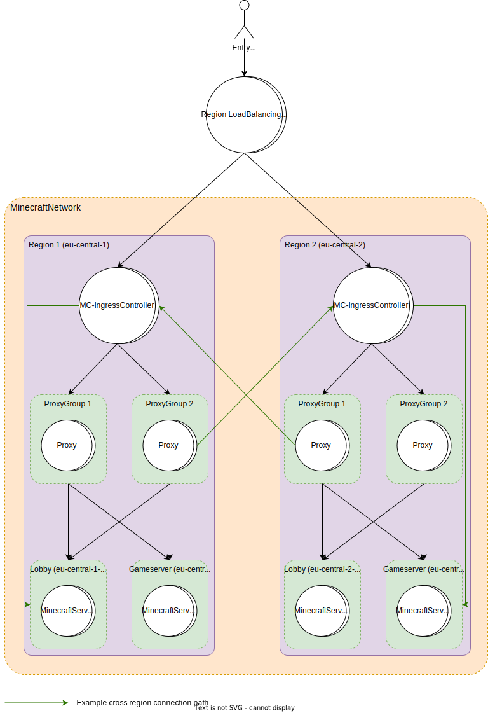

# Moonshine

This project is currently under development and far from finished. Using it is currently not possible, but you can investigate the source code and test it out if you know what you're doing.

## The Goal
is to build a highly scalable infrastructure for Minecraft networks providing and later an optional web interface to manage everything.
It runs on Kubernetes to be highly capable and organized.
Using Gateways for Proxies allows a giant number of players on the same Minecraft network.
To horizontally scale the system, the plugin provides metrics.

You can join [here](https://discord.gg/aZKuas4) to discuss this project or use the discussions tab of GitHub.

## Concept
The base idea is to create a highly available and highly scalable Minecraft Server Network Infrastructure.

In order to achieve that goal we are very opinionated on how to do things.

These key points must be considered at all times:
- The network should theoretically be able to scale infinitely.
- The ping of all players should be as low as possible.
- Minecraft Clients down to 1.8 should be supported.
- Security is crucial.
- Updates (of plugins, servers etc.) should not be disruptive.
- A crash should be as non-disruptive as possible. E.g. switch to another lobby or a game server that can recover the previous state.
- Servers, Gateways and Proxies should be statically or dynamically provisioned and unprovisioned.
- Central databases should be avoided whenever possible. If absolutely needed a database must be able to scale infinitely according to it's requirements.

## Databases
For the goals defined above here are some more details on how to work with databases.  
Everything that can be stateless should be stateless. Therefore, databases should be prevented wherever possible.

In some cases a database is still definitely needed. Everything that uses that database should be carefully modeled to ensure theoretical infinite scalability.
Here are some key points when using a database.
- In case of cross-region communication traffic should be minimized as much as possible.
- The database should be a sharded cluster with at least two replicas of a shard in the region where it is needed.
- Everything that uses a database must be able to only cause load on the affected shard.
- Load should be somewhat equally distributed across shards. For that shard-keys like a hashed UUID or server-id should be used.

### Do's
- Store player statistics with the players UUID as shard-key and only hit the needed shard.
- Store player bans with the UUID as the shard-key and only hit the needed shard.
- Store an id (possibly internally) to a players clan with the shard-key being the players UUID. This might hit a second shard with clan information.
- Use the shortest reference path possible to hit the least shards possible.
- In case of MongoDB use mongos.

### Dont's
- Don't use a randomly generated id for shard-keys.
- Don't hit shards that aren't responsible for the used key.
- Don't store a single value for more than one thing.
- Don't store a player count of the entire network. Instead, use monitoring to aggregate such numbers.

## Architecture

## Transfer Packet
The transfer packet was introduced in 1.20.5.
The Gateway would be unnecessary with that packet as the proxy can just move the player to another one.
This however does not work with clients up to 1.20.4 and therefore the Gateway is needed.
This feature alongside the new cookies will be used anyway to seamlessly move players to other proxies when they are restarted for supported clients.
