# Module Redstonecloud-Plugin

This is the plugin for the Redstonecloud System.

This part is the only part of the Redstonecloud System that is strictly necessary to work.
This single jar must be included on every server and proxy.  
This works for:
- Bukkit/Spigot/Paper 1.8+
- Bungeecord/Waterfall 1.16+
- Minestom
- Sponge 7.2+
- Velocity 3.0.1+

The whole system is built to run on Kubernetes.

## Concept
The concept is to use how Kubernetes is built.
We have 3 layers in this example, but you can do whatever you want.
After going through the LoadBalancer the player connects to one of the Entry Proxies.
Every Entry Proxy knows the Services of the Game Proxies which are load balanced as well.
Game Proxies are there to organize your network. So Game Proxies build up groups (one group for lobbies, one group for Skyblock, etc.) and know each Game Server.
So the load can be balanced across the network.
Additionally, this plugin provides metrics to allow horizontal scaling using something like player count to limit player count on a Game Server if the game is built to be 2v2 for example.
On top of that, this plugin provides an API on Proxy Servers to programmatically create Game Servers for something like private Game Servers.

```mermaid
flowchart TB
    entrypoint[Entrypoint] --> loadbalancer[Load Balancer]:::service --> proxy_1 & proxy_2 --> lobby_entrypoint & game_1_entrypoint & game_2_entrypoint
    subgraph proxies [Entry Proxies]
        proxy_1[Proxy]:::proxy
        proxy_2[Proxy]:::proxy
    end

    subgraph subproxies [Game Proxies]
        lobbyproxy_db_1[(Database)]:::db
        game_1_proxy_db_1[(Database)]:::db
        game_2_proxy_db_1[(Database)]:::db

        subgraph lobbyproxies [Lobby Proxies]
            lobby_entrypoint[Service]:::service --> lobby_proxy_1[Proxy] & lobby_proxy_2[Proxy]
        end
        subgraph game1proxies [Game 1 Proxies]
            game_1_entrypoint[Service]:::service --> game_1_proxy_1[Proxy] & game_1_proxy_2[Proxy]
        end
        subgraph game2proxies [Game 2 Proxies]
            game_2_entrypoint[Service]:::service --> game_2_proxy_1[Proxy] & game_2_proxy_2[Proxy]
        end
    end
    
    lobby_proxy_1 & lobby_proxy_2 -.- lobbyproxy_db_1 -.- lobby_sub_1 & lobby_sub_2
    game_1_proxy_1 & game_1_proxy_2 -.- game_1_proxy_db_1 -.- game_1_sub_1 & game_1_sub_2
    game_2_proxy_1 & game_2_proxy_2 -.- game_2_proxy_db_1 -.- game_2_sub_1 & game_2_sub_2
    
    subgraph gameservers [Game Servers]
        lobby_proxy_1 & lobby_proxy_2 ---> lobby_sub_1 & lobby_sub_2
        game_1_proxy_1 & game_1_proxy_2 ---> game_1_sub_1 & game_1_sub_2
        game_2_proxy_1 & game_2_proxy_2 ---> game_2_sub_1 & game_2_sub_2

        subgraph lobby_sub [Lobby Subservers]
            lobby_sub_1[Lobby Subserver 1]:::game
            lobby_sub_2[Lobby Subserver 2]:::game
        end
        subgraph game_1_sub [Game 1 Subservers]
            game_1_sub_1[Game 1 Subserver 1]:::game
            game_1_sub_2[Game 1 Subserver 2]:::game
        end
        subgraph game_2_sub [Game 2 Subservers]
            game_2_sub_1[Game 2 Subserver 1]:::game
            game_2_sub_2[Game 2 Subserver 2]:::game
        end
    end
    
    classDef default fill:#121213,color:white,stroke:white;
    classDef proxy fill:#0f0,color:black;
    classDef game fill:yellow,color:black;
    classDef db fill:grey;
    classDef service fill:#326ce5;
    classDef outer fill:#222;

    class subproxies,gameservers,proxies outer;

    class lobby_proxy_1,lobby_proxy_2,game_1_proxy_1,game_1_proxy_2,game_2_proxy_1,game_2_proxy_2 proxy;
```

